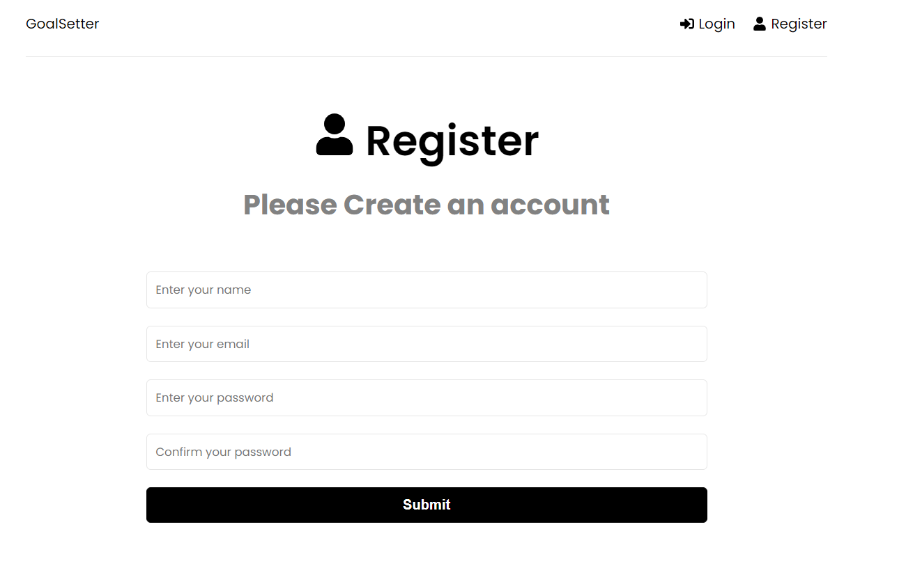

# Goal Setter App

This is a beautiful CRUD application with authentication that helps users manages goals they set for themselves. A person can create a goal, edit a goal, and delete a goal.
The app shows how long the goal was created, this is done using [MomentJS](https://momentjs.com).

Find the Live Site hosted on [Heroku](https://www.heroku.com/) here: [https://goalsakuddev.herokuapp.com/](https://goalsakuddev.herokuapp.com/)

## Built With

- [React.js](https://reactjs.org)
- [ExpressJs](https://expressjs.com)
- [Redux Toolkit](https://redux-toolkit.js.org/)
- [MongoDB](https://www.mongodb.com/)
- [Mongoose](https://www.mongoosejs.com/)
- [JWT](https://jwt.io/)
- HTML
- CSS

<!-- GETTING STARTED -->

## Running this Application locally

Make sure you have installed all of the following prerequisites on your development machine:

- Nodejs
- MongoDB

### Steps

1. Clone the application
2. Navigate to the root of the application and run `npm install` in your terminal
3. Navigate to the frontend folder and run `npm install` in your terminal
4. In the root of the app rename the `.env.example` file to `.env` and fill in the values required
5. In your terminal, ensure you are in the root of the application and run `npm run dev`
